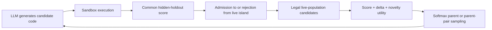

# Frontis/OpenRSI Search-Controller Study

## Complete experiment report for the lab meeting

**Date:** 2026-08-16
**Research objective:** Understand how the Frontis/OpenRSI evolutionary search
controller selects parents, identify concrete failure mechanisms, and obtain a
carefully bounded observation that can motivate future controller improvements.

---

## 1. Executive summary

We studied the parent-selection mechanism used by the audited
Frontis/OpenMLE-Evo implementation on one inexpensive Kaggle-style text
classification task. The controller assigns each legal parent candidate a utility
from three components:

\[
U_i = 1.0\,S_i + 0.4\,D_i + 0.25\,N_i,
\]

where \(S_i\) is normalized current score, \(D_i\) is normalized positive progress
over the candidate's parent, and \(N_i\) is rule-based method-family novelty. Parent
probabilities are obtained by a softmax over these utilities.

Our first counterfactual analysis appeared to show that Frontis preferred poor
parents. A full audit found that interpretation invalid: the probe compared every
successful node in the journal/archive, even though Frontis can select only members
of the current live island population. The apparent oracle was never a legal parent.
We retracted that selector claim, repaired population-state and sampling provenance,
preregistered a corrected experiment, and ran three fresh trajectories.

### Main evidence-grounded finding

> In three independent short trajectories on `spooky-author-identification`, the
> audited novelty component was non-discriminative at **all 8/8 eligible exact
> live-population decision states, replicated in 3/3 trajectories**. Every legal
> candidate was labeled `sklearn`, so novelty added the same constant to all
> candidate utilities and exerted exactly zero selection pressure.

Additional observations:

- Score discriminated at 8/8 legal states.
- Delta discriminated at 5/8 legal states.
- Among six one-parent `Improve` states, delta changed selection probabilities in
  three, with total-variation distances of `0.0733`, `0.0778`, and `0.0996` from
  score-only selection.
- Delta did not change the top-ranked parent in any of those six Improve states.
- All 24 generated child records, including four failed children, were retained.

The conclusion is intentionally narrow. We found a repeatable **controller-activation
failure in this setting**: a configured novelty term had no behavioral effect because
the family representation was too coarse for the legal population. We did not show
that novelty harms performance, that Frontis generally selects bad parents, or that a
replacement selector would improve downstream search.

---

## 2. Motivation and research questions

Frontis itself identifies candidate evaluation as crude and coarse: candidate
utility is computed from a small number of fixed signals using a fixed formula. With
limited compute, reproducing the complete benchmark was not realistic. We therefore
used a controlled small-task case study to examine the search mechanism directly.

The research evolved through three questions:

1. **Search-value question:** Does higher Frontis parent utility predict children
   with better future quality?
2. **Mechanism question:** Which utility components—score, delta, and novelty—are
   actually active at legal parent-selection states?
3. **Improvement question:** If a component is inactive or misleading, what kind of
   controller modification should later be tested?

The completed work provides a strong answer to Question 2 in one bounded setting.
Question 1 remains unresolved because the original counterfactual design did not
cover the true legal action support. Question 3 is now motivated, but no replacement
selector has yet been evaluated.

---

## 3. System and task under study

### Software and model

- OpenRSI commit: `ece6cbdf115ed72c3b62643a836504d77365e3a0`
- MLE-Bench commit used by the baseline: `507f92e1138bb6e40dac5c6ee7a6758e6424bf97`
- Search implementation: OpenMLE-Evo/AIRA-Evo evolutionary solver
- Model: `Frontis-MA1-35B-Q4_K_M.gguf`
- Model server: llama.cpp
- Hardware: RunPod NVIDIA A40

This is a case study of the audited OpenRSI/OpenMLE-Evo execution path using a
quantized Frontis-MA1 model. It is not a claim that the published BF16 Frontis system
or every Frontis harness behaves identically.

### Task and metric

- Task: Kaggle `spooky-author-identification`
- Input: short text excerpts
- Target: one of three authors—EAP, HPL, or MWS
- Metric: multiclass logarithmic loss; **lower is better**
- Hidden evaluation: fixed stratified 20% holdout reconstructed from the public
  labeled training data with split seed 42
- Hidden rows: 3,525

Generated programs could access only visible training data and unlabeled test-like
rows. Hidden answer labels were stored outside the generated-code mount and were
used only by the sandbox scorer. Isolation checks verified that generated programs
could not access the answer file, host workspace, SSH/Kaggle credentials, or network.

### Search flow

A crucial distinction is that the **journal/archive** contains every evaluated node,
whereas the **live island population** contains only currently admitted nodes that
are legally selectable. Most of the redesign was necessary because the initial
analysis conflated these two sets.

---

## 4. Experiment chronology

### 4.1 Infrastructure and smoke tests

We first established that the full local reproduction path worked:

- Frontis-MA1 served successfully through llama.cpp.
- Generated Python programs executed inside the sandbox.
- Hidden-holdout evaluation produced comparable scores.
- Submission and trajectory artifacts were stored correctly.
- Generated-code filesystem and network isolation passed.

These tests validated infrastructure only; they were not evidence about search
quality.

### 4.2 Baseline evolutionary trajectory

### Settings

- Five configured generations
- Two individuals per generation
- Maximum 11 journal steps
- One island
- Search time budget: 1,800 seconds
- Model-plus-sandbox budget: 2,400 seconds
- Sandbox execution timeout: 600 seconds
- Utility weights: score `1.0`, delta `0.4`, novelty `0.25`
- Operators observed: 2 Draft, 3 Improve, 3 Crossover, 2 Debug

### Results

- Ten generated nodes plus a synthetic root
- Eight successful evaluations and two failed evaluations
- Best hidden validation loss: `0.36072`
- The best node was the first Draft and was never improved
- One Debug repair tied the incumbent at `0.36072`
- The two failed nodes were expensive Crossover programs

This baseline was useful for observing the search and generating hypotheses. It was
too small to support a general search-quality conclusion.

### 4.3 Initial counterfactual parent probe — exploratory and superseded

### What we attempted

At three baseline snapshots, we selected four successful journal nodes and forced
two `Improve` offspring from each parent. This produced:

- 3 nested snapshots
- 12 parent × snapshot units
- 24 generated children
- 19 successful and 5 failed children
- 2 children per probed parent

The probe used the same hidden holdout, and its children were isolated from the
baseline search so they could not contaminate the original trajectory.

### Initial apparent result

Using parent-relative improvement, the first analysis suggested strong negative
alignment between Frontis utility and repairability. The corrected minimization
formula gave Pearson `r = -0.680` and Spearman `rho = -0.752`; the nominal utility
winner disagreed with the forced-probe improvement winner at all three snapshots.

### Why that selector claim was invalid

The probe formed its candidate set from all successful journal nodes. Frontis
actually samples only from the current live island population. The recurring apparent
oracle, node `f28d7d…`, was never admitted and therefore was not a legal parent after
it was generated.

Other limitations were also important:

- The three snapshots were nested within one trajectory, not independent discoveries.
- Only two offspring were sampled per parent.
- The probe forced `Improve`, regardless of the policy's actual operator choice.
- The LLM request seed was not propagated to llama.cpp, so repeats were stochastic,
  not seed-paired.
- The original handoff formula had the wrong sign for minimized log loss.
- Probability calculations renormalized over the four probed archive nodes rather
  than the true legal support.

### What remains valid from this probe

- It is a valid archive-wide forced-Improve repairability experiment.
- Hidden child scores are comparable.
- None of the 24 children beat the incumbent `0.36072`; the closest reached `0.36350`.
- The archive-only node `f28d7d…` was highly repairable under the stored cross-branch
  memory context.

What does **not** remain valid is any claim that Frontis repeatedly selected the
wrong legal parent or incurred the originally reported selector regret.

### 4.4 Initial novelty and family audit — descriptive only

We examined whether stored node-level family rarity corresponded to lexical code
distance.

### Design

- Ten baseline nodes
- Nine labeled `sklearn`, one labeled `ensemble`
- Forty-five pairwise comparisons
- Code distance: `1 - Jaccard` over normalized Python lexical-token sets

### Observations

- Novelty had only weak relationships with the three lexical-distance summaries.
- Mean between-family distance exceeded mean within-family distance by about `0.122`.
- The nominal pairwise Mann–Whitney result was not interpretable as independent
  evidence because every between-family pair shared the single ensemble node.
- A post-hoc high/low novelty failure comparison was also too small and dependent
  for a useful inference.

The important audit discovery was conceptual: stored node novelty is creation-time
metadata, whereas parent selection recomputes novelty over legal live candidates.
The archive-wide lexical analysis therefore could not establish whether novelty
helped or harmed parent selection.

### 4.5 Search-value audit — conceptually improved, numerically invalid for selection

We recognized that parent-relative improvement can favor weak parents simply because
they have more room to improve. We therefore analyzed more search-relevant outcomes:

- Mean and best absolute child quality
- Probability of beating the incumbent
- Shortfall from the incumbent
- Failure-sensitive parent outcomes
- Score/delta/novelty component correlations and ablations

This correction of the **outcome definition** was sound. However, the numerical
selector conclusions remained invalid because outcomes and utilities were still
computed over archive-wide or incompletely covered legal support. These outputs are
retained for transparency but are not used in the final claim.

### 4.6 Complete design reevaluation

The reevaluation established the following:

### Checks that passed

- Hidden scores came from the same fixed holdout and were comparable across programs.
- Probe children were isolated from the baseline search.
- No direct future-node leakage was found in the reconstructed prefix journals.
- Generated programs could not access hidden labels.

### Problems requiring redesign

- Journal nodes were mistaken for legal live-population candidates.
- Built-in journal-only checkpoint restoration did not reproduce exact island
  membership or uninterrupted admission history.
- Exact rendered prompts were not first-class artifacts.
- LLM request seeds were not forwarded to llama.cpp.
- Counterfactual clones therefore could not yet be proven equivalent.

### Corrected baseline interpretation

When the actual live support was reconstructed, all legal baseline parents were in
the `sklearn` family and had tied positive-delta components. Thus novelty and delta
were constant at those selection events, and the effective ranking was score-only
plus an equal offset. This became discovery evidence for the final confirmation.

---

## 5. Validity instrumentation implemented before confirmation

We stopped new scientific generation until the following controls were implemented.

### Exact evolutionary state

- Persisted exact island membership and order
- Persisted global population statistics and fresh-draft state
- Persisted current generation and step
- Persisted Python and NumPy RNG states
- Created versioned decision-boundary checkpoints
- Added strict state/config compatibility guards

### Exact model-sampling provenance

- Persisted exact prompt messages
- Persisted exact completions
- Persisted complete request kwargs
- Added an explicit root seed to each operator
- Used deterministic call-specific request seeds:

  `request_seed = root_seed + zero_based_call_index`

- Persisted and restored every operator's LLM call counter

A direct llama.cpp check confirmed that identical prompt plus identical seed produced
identical output, while changing the seed changed the output.

### Evaluator and final-submit safeguards

- Reconstructed the exact hidden split only after matching stored IDs, order, text,
  and row counts
- Re-ran scored health and isolation checks
- Added a benchmark-agnostic `solver.final_submit=false` gate so post-search scores
  outside the estimand were not generated

### Verification

The final focused and regression test suite passed: **37 tests passed**. Tests covered
population checkpoints, RNG and LLM call-state restoration, exact prompt/seed traces,
experience memory, hidden validation fitness, final-node selection, and the
final-submit gate.

---

## 6. Confirmatory selector-component activation experiment

### 6.1 Preregistered research question

> In fresh short trajectories on this task, do score, positive delta, and
> method-family novelty discriminate among candidates in the exact legal live
> population at authentic parent-decision states?

This was an activation audit. It did not estimate downstream search value and was
not designed to prove that any component is useful or harmful.

### 6.2 Fixed settings

| Setting | Value |
|---|---|
| Root seeds | `20260816`, `20260817`, `20260818` |
| Trajectories | 3 sequential, independent runs |
| Generations | 4 maximum |
| Individuals per generation | 2 |
| Islands | 1 |
| Maximum journal steps | 9 |
| Search budget | 1,800 s |
| Model-plus-sandbox budget | 2,400 s |
| Execution timeout | 600 s |
| Maximum Debug depth | 1 |
| Crossover eligibility | generation 2 onward |
| Parent temperature | `1.0` |
| Utility weights | score `1.0`, delta `0.4`, novelty `0.25` |
| Score normalization | min–max |
| Delta normalization | min–max positive delta |
| Model temperature | `0.6` |
| Top-p / top-k | `0.95` / `20` |
| Maximum generation tokens | 8,192 |
| Final submission | disabled |

### 6.3 Statistical unit and legal support

Two children within one generation observe the same pre-admission population.
Therefore, the primary unit was a unique:

> trajectory × generation × exact live-population state

Repeated draws from the same state were kept for audit but counted once in the
primary table. A state was eligible only when it had at least two legal candidates.
Trace candidate IDs and order had to exactly match the serialized preceding island.

For each component \(c\), we calculated:

\[
\operatorname{range}(c)=\max_i(c_i)-\min_i(c_i).
\]

A component was called discriminative only when its range exceeded `1e-12`.

For one-parent Improve states, we also compared the full selection distribution with
a score-only softmax on the same legal candidates and temperature. Crossover states
were excluded from this one-parent probability interpretation because crossover
samples unordered parent pairs without replacement.

### 6.4 Primary results

| Root seed | Eligible legal states | Score active | Delta active | Novelty active | Child cards | Failed children |
|---:|---:|---:|---:|---:|---:|---:|
| 20260816 | 3 | 3 | 2 | 0 | 8 | 1 |
| 20260817 | 2 | 2 | 1 | 0 | 8 | 3 |
| 20260818 | 3 | 3 | 2 | 0 | 8 | 0 |
| **Total** | **8** | **8 (100%)** | **5 (62.5%)** | **0 (0%)** | **24** | **4** |

The trajectory-level replication matters more than treating eight correlated states
as independent observations:

- Novelty was inactive throughout in 3/3 trajectories.
- Score was active at every eligible state in 3/3 trajectories.
- Delta was tied at the first eligible state and active later in 3/3 trajectories.

No null-hypothesis significance test is claimed. With three independent trajectories,
the evidence is a replicated exact mechanistic observation, not a population-level
effect-size estimate.

### 6.5 Mechanism audit

All 8/8 eligible states contained only candidates labeled `sklearn`.

The implementation assigns method family through hand-written import and token rules,
including categories such as `sklearn`, `ensemble`, `xgboost`, `lightgbm`, neural
networks, and transformers. Candidate novelty is based on inverse-square-root family
frequency. When all candidates have the same family, their novelty values are equal.

Because softmax is invariant to a common additive constant:

\[
\operatorname{softmax}(U_1+k,\ldots,U_n+k)
=\operatorname{softmax}(U_1,\ldots,U_n),
\]

the configured novelty weight of `0.25` had exactly zero behavioral effect in every
audited legal state.

### 6.6 Delta effect magnitude

There were six eligible one-parent Improve states:

- In 3/6, full utility produced exactly the score-only probabilities because delta
  was tied.
- In 3/6, delta changed the distribution.
- Nonzero total-variation distances were `0.0733`, `0.0778`, and `0.0996`.
- Mean TV distance across all six Improve states was `0.0418`.
- The full and score-only argmax parent sets were identical in 6/6 states.

Thus score determined the top-ranked parent throughout this sample. Delta sometimes
made a moderate change to stochastic sampling probabilities, but did not reverse the
top-ranked choice.

---

## 7. Integrity checks, deviations, and exclusions

Scientific failures and implementation problems were retained and documented rather
than silently discarded.

### Excluded fixed-seed attempt

The first attempted confirmation reused the same fixed request seed for every call.
Identical Draft prompts produced identical outputs, artificially suppressing diversity.
The attempt was stopped before selector analysis and excluded. The call-specific seed
schedule was implemented before any valid confirmation run.

### Excluded missing-scorer attempt

A pod restart removed the root-only hidden validation answers. Candidate programs ran,
but the scorer correctly refused to assign scores. The attempt was stopped and excluded
before selector analysis. The exact hidden split was restored and reverified.

### Seed-20260816 post-search evaluation

After seed 20260816's fixed search had ended, an unintended self-validation evaluation
ran because the existing final-submit gate applied only to NatureBench. It is not an
official private-test score and is excluded from every endpoint. It could not affect
the already-recorded search states. The gate was fixed and tested before seeds
20260817 and 20260818.

### Hydra launch rejection

The first seed-20260817 launch used normal override syntax for a new strict-config key.
Hydra rejected it before creating an output directory or making any model call. Append
syntax was then used. This was not counted as a trajectory.

### Duplicate generation checkpoint paths

Seed 20260816 saved both a generation-3 boundary checkpoint and a terminal step-9
checkpoint under generation 3. Their complete population payloads were canonically
identical; only solver step metadata differed. The analyzer accepts multiple snapshots
only when their full serialized population payloads are identical. Non-equivalent
duplicates remain a hard failure.

### Final provenance totals

- 3 valid trajectories
- 24 retained child cards
- 4 retained failed children
- 15 raw multi-candidate draws, deduplicated to 8 unique legal population states
- 27 journal nodes total, 9 per trajectory
- 48 traced LLM calls, 16 per trajectory
- Exact prompt, completion, kwargs, and call-specific seed present for every traced call
- `runner_failures=[]` for all three valid trajectories
- Recorded utilities and probabilities independently recomputed to tolerance `1e-10`
- Local reanalysis matched the saved pod analysis outputs exactly

---

## 8. Conclusions and defensible claims

### 8.1 What the evidence directly establishes

1. **Novelty was operationally inactive in this setting.** It was
   non-discriminative at every eligible exact legal state in all three confirmation
   trajectories.
2. **The inactivity has an identified implementation-level mechanism.** The coarse
   rule-based family detector mapped every legal candidate to `sklearn`, giving every
   candidate the same novelty offset.
3. **Score dominated the observed top ranking.** Score discriminated everywhere;
   delta sometimes shifted probabilities but never changed the top-ranked parent in
   the six Improve states.
4. **Archive-wide counterfactual conclusions are unsafe for an evolutionary search.**
   Journal membership is not equivalent to legal population membership. Any selector
   evaluation must use the true live support.

### 8.2 Supported hypothesis for future work

> A method-family rarity signal can collapse in homogeneous live populations even
> when candidate programs differ meaningfully in features, estimators, preprocessing,
> or hyperparameters. A finer semantic, code-structural, prediction-behavior, or
> trajectory-aware diversity representation may provide a more consistently active
> search signal.

This is a hypothesis motivated by the mechanism audit, not yet a demonstrated
performance improvement.

### 8.3 Claims that must not be made

- “Frontis generally chooses bad parents.”
- “Novelty hurts Frontis performance.”
- “Delta is useless.”
- “A learned selector will improve the benchmark.”
- “The result is statistically significant across tasks.”
- “The published BF16 Frontis system behaves identically.”

### 8.4 Limitations

- One task
- Three independent trajectories
- Eight eligible legal states
- One quantized 35B model
- Short search budgets
- One hidden holdout split
- One-island configuration
- Activation, not downstream causal value, was measured

These limitations constrain generalization. They do not invalidate the exact bounded
claim about the observed legal states.

---

## 9. Recommended next experiments

The next experiment should be chosen based on the claim we want.

### Priority A: cross-task activation replication

Run the same preregistered legal-population component audit on one additional cheap
task with a different ML modality or model-family mix. The goal is to distinguish:

- task-specific homogeneous-family collapse; from
- a broader tendency of the rule-based novelty signal to become inactive.

This is the lowest-risk extension of the current claim.

### Priority B: predeclared finer-diversity intervention

Compare the current family novelty with one fixed alternative, such as:

- AST/code-structure distance;
- model/preprocessing pipeline signatures;
- prediction-vector diversity on a fixed public calibration subset; or
- learned code embeddings computed without hidden labels.

The first outcome should be **activation and redundancy**, not benchmark improvement:
how often the alternative discriminates, how correlated it is with score/delta, and
whether it changes legal action probabilities.

### Priority C: downstream search-value test

Only after a repeatable legal-state difference is found:

1. Clone an exact live state into matched arms.
2. Force only the first legal parent or parent pair.
3. Admit/reject the child normally.
4. Resume the full unconstrained population policy.
5. Use matched evaluation or compute budgets.
6. Measure final/best hidden score, incumbent-update probability, area under the
   best-score curve, failures, and runtime.

Frontis may return to any surviving population member on the next step, so a forced
single descendant lineage is not a valid substitute for global evolutionary search.

---

## 10. Suggested meeting presentation

### One-sentence opening

> We audited whether Frontis's three parent-utility signals are actually active on
> the legal evolutionary population, and found that its novelty term completely
> collapsed across three independent trajectories because every selectable candidate
> received the same coarse `sklearn` family label.

### Five-part talk track

1. **Motivation:** Frontis uses a fixed weighted utility over score, progress, and
   novelty; its own limitations suggest this evaluation is coarse.
2. **Initial exploration and correction:** Our first counterfactual probe looked
   negative, but a full audit showed it used archive nodes rather than legal live
   parents. We retracted that claim and repaired observability.
3. **Corrected design:** Three preregistered trajectories, exact island checkpoints,
   common hidden metric, exact prompt/seed provenance, failure retention, and strict
   recomputation checks.
4. **Main result:** Score active 8/8, delta active 5/8, novelty active 0/8; all eight
   states contained only `sklearn` candidates. Delta changed probabilities in half
   the Improve states but never changed the top-ranked parent.
5. **Takeaway:** Coarse family rarity can be configured but behaviorally inert. The
   next step is cross-task replication or a predeclared finer diversity signal—not a
   claim that we have already improved Frontis.

### Recommended result slide

| Signal | Active legal states | Interpretation |
|---|---:|---|
| Score | 8/8 | Always differentiated legal candidates |
| Delta | 5/8 | Became active later; sometimes shifted probabilities |
| Novelty | 0/8 | Equal `sklearn` family offset; zero policy effect |

### Likely questions and concise answers

**Is eight states enough?**
Enough for the exact bounded observation because the pattern replicated in all three
trajectories. Not enough for a general statement about Frontis or other tasks.

**Is this statistically significant?**
We do not claim a population-level significance test. The result is a deterministic
mechanistic fact about every audited legal state, with trajectory-level replication.

**Did novelty make performance worse?**
We did not test that. Novelty had zero selection effect here, so this experiment cannot
estimate harm or benefit.

**Why not use the original counterfactual result?**
Its apparent best parent was archive-only and not legally selectable. Evaluating a
policy on actions it could not take does not estimate selector quality.

**Could delta still matter?**
Yes. It changed the stochastic distribution in 3/6 Improve states, although it did
not change the top-ranked parent in this sample.

**What is the most promising improvement direction?**
A finer diversity representation that distinguishes meaningful pipeline differences
within broad libraries such as sklearn, followed by a legal-state matched downstream
experiment.

---

## 11. Artifact map

- Project law: `AGENTS.md`
- Complete design audit: `analysis/RESEARCH_DESIGN_REEVALUATION.md`
- Frozen confirmation design:
  `experiments/selector_component_confirmation/PREREGISTRATION.md`
- Final lab brief:
  `experiments/selector_component_confirmation/results/LAB_BRIEF.md`
- Extended analysis summary:
  `experiments/selector_component_confirmation/results/analysis_summary.json`
- Per-state result table:
  `experiments/selector_component_confirmation/results/legal_state_components.csv`
- Analyzer: `analysis/analyze_legal_selector_components.py`
- Valid trajectory summaries:
  `experiments/selector_component_confirmation/results/seed-20260816`,
  `seed-20260817`, and `seed-20260818`
- Excluded attempts (raw artifacts retained outside Git): fixed-seed and
  missing-secure-evaluator attempts documented in the preregistration
- Authoritative cumulative instrumentation patch:
  `third_party/openrsi_patches/0004_final_validity_instrumentation.patch`

---

## Final presentation-ready claim

> In a preregistered three-trajectory case study on Spooky Author Identification,
> using exact legal live-population states and a common hidden metric, the audited
> Frontis/OpenMLE-Evo novelty component was non-discriminative at all 8/8 eligible
> decision states. Every legal candidate was assigned the same rule-based `sklearn`
> family, so the configured novelty term added an equal constant and had exactly zero
> effect on selection probabilities. Score discriminated everywhere; delta sometimes
> shifted sampling probabilities but did not change the top-ranked parent. This
> identifies a concrete, repeatable representation bottleneck in this setting and
> motivates testing finer diversity signals, while not yet establishing downstream
> performance harm or generalization to other tasks.
